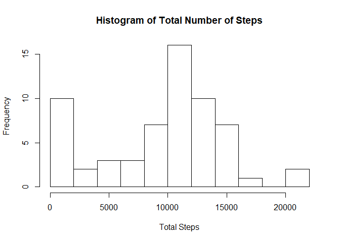

## Loading and preprocessing the data

The raw data is read in from the zip file (activity.zip).


```r
library(readr)
# Column types are specified as (double, Date, double)
raw_data <- read_csv("activity.zip", col_types = "dDd")
```


## Mean total number of steps taken per day


```r
library(dplyr)

steps_per_day <- raw_data %>%
  group_by(date) %>%
  summarise(total_steps = sum(steps, na.rm = TRUE))

steps_summary <- summary(steps_per_day$total_steps)
raw_mean <- formatC(steps_summary[["Mean"]],
                    format = "f",
                    big.mark = ",",
                    big.interval = 3L,
                    digits = 2)
raw_median <- formatC(steps_summary[["Median"]],
                    format = "f",
                    big.mark = ",",
                    big.interval = 3L,
                    digits = 2)

hist(steps_per_day$total_steps, plot = TRUE,
     breaks = 10,
     main = "Histogram of Total Number of Steps",
     xlab = "Total Steps")
```

<!-- -->

For the raw dataset:

* Mean steps taken per day: 9,354.23

* Median steps taken per day: 10,395.00

## Average daily activity pattern

```r
library(dplyr)

avg_steps_per_interval <- raw_data %>%
  group_by(interval) %>%
  summarise(avg_steps = mean(steps, na.rm = TRUE))

max_interval <- avg_steps_per_interval %>%
  filter(avg_steps == max(avg_steps))
hours <- as.integer(max_interval$interval/100)
mins <- as.integer(max_interval$interval %% 100)

plot(avg_steps_per_interval$interval,
     avg_steps_per_interval$avg_steps,
     type = "l", main = "Average Activity Per Time Interval",
     xlab = "Interval", ylab = "Average Steps")
```

<!-- -->

The maximum number of average steps in any interval, is taken at the interval beginning at 8h35.

## Inputting missing values


```r
library(dplyr)

num_missing <- sum(is.na(raw_data$steps))

new_dataset <- merge(raw_data, avg_steps_per_interval,
                      all.x = TRUE) %>%
  arrange(date) %>%
  mutate(steps_new = ifelse(is.na(steps), avg_steps, steps))

new_steps_per_day <- new_dataset %>%
  group_by(date) %>%
  summarise(total_steps = sum(steps_new, na.rm = TRUE))

new_steps_summary <- summary(new_steps_per_day$total_steps)
new_mean <- formatC(new_steps_summary[["Mean"]],
                    format = "f",
                    big.mark = ",",
                    big.interval = 3L,
                    digits = 2)
new_median <- formatC(new_steps_summary[["Median"]],
                    format = "f",
                    big.mark = ",",
                    big.interval = 3L,
                    digits = 2)

hist(new_steps_per_day$total_steps, plot = TRUE,
     breaks = 10,
     main = "Histogram of Total Number of Steps",
     xlab = "Total Steps")
```

<!-- -->

There are 2304 missing values in the original dataset.

Missing values from the dataset have been replaced with the mean (across all days) of the relevant 5-minute interval.

For the new processed dataset:

* Mean steps taken per day: 10,766.19

* Median steps taken per day: 10,766.19

By replacing the missing values, the mean and median have come in line. The missing values are outliers which skews the results of the mean (negatively).

## Activity patterns between weekdays and weekends

```r
library(dplyr)
library(ggplot2)

transform_data <- new_dataset %>%
  mutate(day_factor = ifelse(weekdays(date) %in% c("Saturday", "Sunday"), "weekend", "weekday"))

factor_avg_steps_per_interval <- transform_data %>%
  group_by(interval, day_factor) %>%
  summarise(avg_steps = mean(steps_new, na.rm = TRUE))

ggplot2::ggplot(data = factor_avg_steps_per_interval,
       aes(interval, avg_steps)) +
  geom_line(color = "darkcyan") +
  labs(title = "Average Activity per Time Interval",
       x = "Interval",
       y = "Average Steps") +
  facet_grid(day_factor ~ .)
```

<!-- -->

